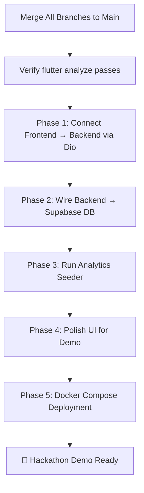

# 🔀 Post-Merge Integration Roadmap — MindMirror

> **Context:** This document is written for the single agent session that will operate on the merged `main` branch after all four domain branches (`frontend-rafay`, `backend-dar`, `infrastructure-talal`, `analytics-shayan`) have been combined. It assumes no prior context and provides everything needed to complete the MindMirror application for a hackathon demo.

---

## 0. Pre-Merge Checklist

Before beginning integration work, verify these items from each branch:

| Branch | Key Deliverable | Verify |
|---|---|---|
| `frontend-rafay` | Flutter app with mock services, full dashboard UI | `flutter analyze` passes, app runs on Windows |
| `backend-dar` | FastAPI with `POST /entries`, `GET /entries`, `GET /insights/current` | Endpoints return JSON matching `docs/JSON_CONTRACT.md` |
| `infrastructure-talal` | Supabase DB with `journal_entries` table, `jsonb` columns for tags/triggers | Migrations run, DB accepts inserts |
| `analytics-shayan` | Synthetic data seeder, correlation math engine | CSV/SQL output matches `journal_entries` schema |

> **⚠️ Read each branch's `.branch_context.md`** before touching any code. They document the exact mocks, assumptions, and integration demands made by each isolated agent.

---

## 1. PHASE 1: Connect Frontend to Backend (Critical Path)

This is the single most important integration task. The frontend currently runs entirely on mock data.

### 1.1 Create Real HTTP Services

**What to do:** Create two new service files that replace the mock services with real `Dio`-backed HTTP calls. Do NOT delete the mock services — keep them as fallbacks.

#### [NEW] `frontend/lib/services/journal_service.dart`

```
Replaces: MockJournalService
Dependency: dio (already in pubspec.yaml)
```

| Method | HTTP Call | Request | Response |
|---|---|---|---|
| `getHistoricalEntries({limit, offset})` | `GET /api/v1/entries?limit=10&offset=0` | Query params | `{ data: [JournalEntry[]], meta: { total, has_more } }` |
| `submitEntry(String rawText)` | `POST /api/v1/entries` | `{ "raw_text": "..." }` | Single enriched `JournalEntry` (201) |

#### [NEW] `frontend/lib/services/insight_service.dart`

| Method | HTTP Call | Response |
|---|---|---|
| `getCurrentInsight()` | `GET /api/v1/insights/current` | Single `InsightModel` (200) |

**Error handling:** All 4xx/5xx errors return `{ error: { code, message, details } }` per the JSON contract. Parse this and surface it to the Provider.

### 1.2 Update Providers to Use Real Services

**Files to modify:**
- `frontend/lib/controllers/journal_provider.dart` — Change `MockJournalService` → `JournalService`
- `frontend/lib/controllers/insight_provider.dart` — Change `MockInsightService` → `InsightService`

**Design decision:** Consider injecting the service via the constructor so you can toggle between mock and real at the `MultiProvider` level in `main.dart`. This makes it trivial to demo with mocks if the backend goes down.

```dart
// Example pattern:
class JournalProvider extends ChangeNotifier {
  final JournalServiceBase _service; // Abstract base
  JournalProvider(this._service);
  // ...
}
```

### 1.3 Configure Base URL

Create a config file or environment variable for the API base URL:
- **Local dev:** `http://localhost:8000` (or whatever port the FastAPI backend uses)
- **Docker compose:** `http://backend:8000` (internal Docker network name)

---

## 2. PHASE 2: Wire Backend to Infrastructure

This phase connects Dar's FastAPI orchestration layer to Talal's Supabase database.

### 2.1 Database Connection

- Ensure the backend's database connection string points to Supabase's PostgreSQL instance
- Verify the `journal_entries` table schema matches the Pydantic models in the backend
- Confirm `jsonb` columns for `tags` and `triggers` accept the array structures

### 2.2 LLM Pipeline Verification

- Verify the backend's `POST /api/v1/entries` endpoint:
  1. Receives `raw_text` from the frontend
  2. Sends it through the LLM orchestration (Google Gemini via `instructor`)
  3. Extracts `sentiment_score`, `tags`, and `triggers`
  4. Stores the enriched entry in Supabase
  5. Returns the complete `JournalEntry` JSON to the frontend

### 2.3 Insight Generation Pipeline

- Verify `GET /api/v1/insights/current` actually queries historical entries from the DB, runs the correlation analysis, and returns a real `InsightModel`
- The frontend's `InsightCard` will automatically display whatever the backend returns — no frontend changes needed if the JSON matches

---

## 3. PHASE 3: Seed Analytics Data

### 3.1 Load Synthetic Data

- Run Shayan's data seeder script to populate the database with ~30 days of synthetic journal entries
- The seeder should inject realistic sentiment patterns (e.g., `-0.4` drops when `sleep_hours < 6`, `+0.3` boosts when `tags` includes `gym`)
- This data powers the sentiment trend chart and gives the AI insight engine enough signal to produce meaningful correlations

### 3.2 Verify Chart Rendering

- After seeding, the frontend's `SentimentChart` should render a compelling 30-day trend line instead of just 2 data points
- The `InsightCard` should display a real correlation discovered from the seeded data

---

## 4. PHASE 4: Polish for Demo (Hackathon Priority)

These are the high-impact, low-effort improvements that will make the biggest visual difference in a 3-minute pitch.

### 4.1 Expand Mock Data (Immediate Fallback)

If the backend integration hits blockers, enrich `MockJournalService` with 7–10 entries spanning a week with varied sentiment scores. This alone makes the chart look production-ready.

### 4.2 Fix Sentiment Chart Hover Interaction

**File:** `frontend/lib/modules/dashboard/widgets/sentiment_chart.dart`  
**Issue:** The `_indexFromX()` method currently returns `null`. To enable tap-to-inspect:

```dart
int? _indexFromX(double dx, List<JournalEntry> entries) {
  if (entries.length < 2) return null;
  final renderBox = context.findRenderObject() as RenderBox?;
  if (renderBox == null) return null;
  final chartW = renderBox.size.width - 36.0; // paddingLeft
  final ratio = (dx - 36.0) / chartW;
  final index = (ratio * (entries.length - 1)).round();
  return index.clamp(0, entries.length - 1);
}
```

### 4.3 Add Error State UI

Create a fallback widget that displays gracefully when the backend is unreachable:

```dart
// In DashboardScreen, wrap the Consumer with error handling:
if (provider.error != null) {
  return ErrorFallbackCard(message: provider.error!);
}
```

This requires adding an `error` field to both Providers.

### 4.4 Add Loading Shimmer

Replace the plain `CircularProgressIndicator` in the dashboard with a shimmer skeleton that matches the Insight Card shape. This makes the app feel more polished during the 800ms mock delay.

### 4.5 Insight Card Refresh

Add a subtle refresh mechanism — either a pull-to-refresh on the dashboard or a periodic timer that re-fetches the insight every 60 seconds, so the `AnimatedSwitcher` cross-fade actually fires during the demo.

### 4.6 Date Formatting

**File:** `historical_entries_feed.dart` and `sentiment_chart.dart`  
Replace `entry.createdAt.toString().split(' ')[0]` with proper formatting using the `intl` package (already a transitive dependency):

```dart
import 'package:intl/intl.dart';
DateFormat('MMM d, yyyy').format(entry.createdAt);
```

---

## 5. PHASE 5: Docker Compose & Deployment

### 5.1 Unified Docker Compose

Create a `docker-compose.yml` at the repo root that spins up:
1. **Supabase** (PostgreSQL + Kong Gateway) — from Infrastructure branch
2. **FastAPI Backend** — from Backend branch
3. **(Optional) Flutter Web** — build the frontend for web deployment

### 5.2 Environment Variables

Centralize all config:
```yaml
# .env
SUPABASE_URL=http://supabase-kong:8000
SUPABASE_ANON_KEY=<key>
GOOGLE_API_KEY=<key>
API_BASE_URL=http://backend:8000
```

### 5.3 Run Migrations + Seed

After `docker-compose up`:
1. Run Infrastructure's migration scripts
2. Run Analytics' seeder script
3. Backend auto-connects to Supabase
4. Frontend points at backend URL

---

## 6. Critical Integration Gotchas

> [!CAUTION]
> **SDK Version Lock:** The frontend was built on Flutter `3.39.0-0.1.pre` (beta). If the merge machine uses stable Flutter, the following changes are required in `app_theme.dart`:
> - `CardThemeData` → `CardTheme`
> - Add `background` and `onBackground` parameters to `ColorScheme`
> - `surfaceContainerHighest` → `surfaceVariant`
> - `.withValues(alpha:)` → `.withOpacity()`

> [!CAUTION]
> **Syncfusion Removed:** The sentiment chart was rewritten as a pure `CustomPainter` because `syncfusion_flutter_charts 24.x` is incompatible with Flutter 3.39. If you switch to stable Flutter and want Syncfusion back, re-add the dependency and rewrite `sentiment_chart.dart` to use `SfCartesianChart` + `SplineSeries`.

> [!IMPORTANT]
> **JSON Keys Are Sacred:** The `docs/JSON_CONTRACT.md` is the single source of truth. If any branch deviated from the contract (e.g., renamed `sentiment_score` to `score`), the integration will silently fail. Cross-reference every branch's models against the contract before connecting.

> [!IMPORTANT]
> **Mock-First Fallback:** Keep the mock services alive in the codebase. If the backend goes down during the demo, you can hot-swap back to mocks in `main.dart` by changing the Provider constructor argument. Never delete `MockJournalService` or `MockInsightService`.

---

## 7. Recommended Execution Order



**Estimated time for a single agent to complete all phases:** 2–4 hours, assuming all branches delivered their contracts correctly.
